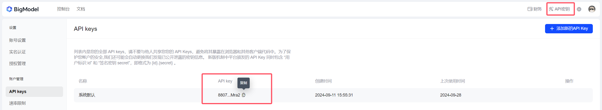

# WIP:《Langchain.js入门和实战》学习笔记

## 使用 Langchain JS 调用本地通义千问

### 安装 Ollama

请访问 [Ollama 网站](https://ollama.com/) 并安装适用于您平台（mac、windows、linux）的版本。

安装完成后，执行以下命令以运行 Qwen 2.5：

```bash
ollama run qwen2.5
```

> **注意**: Ollama 默认运行在 `11434` 端口。

如果你想使用其他模型，可以替换 qwen2.5 为其他模型名称。其他的模型可以在 [这里](https://ollama.com/models) 查看。

### 初始化项目

```bash
mkdir ai-demo
cd ai-demo
yarn init -y
```

### 安装依赖

```bash
yarn add @langchain/core @langchain/ollama
```

### 代码

```js
// index.js
import { Ollama } from "@langchain/ollama"; // 使用了import语句，package.json 中需要指定 type: module

const ollama = new Ollama({
  baseUrl: "http://127.0.0.1:11434",
  model: "qwen2.5", 
});

const res = await ollama.invoke("讲个笑话")

console.log(res); 

```

执行 node index.js 即可看到结果。

## 使用 Langchain JS 调用智谱 ChatGLM API

通过api的方式调用智谱GLM，需要先在[智谱开放平台](https://www.bigmodel.cn/invite?icode=hL0q3HsOdEMnT5TAf2%2BrdVwpqjqOwPB5EXW6OL4DgqY%3D)注册账号，获取API Key。现在注册貌似会送一些积分，足够用了。


> 智谱官方也提供了[SDK](https://github.com/MetaGLM/zhipuai-sdk-nodejs-v4)，这里还是以langchain调用为例。

### 安装 @langchain/community

```bash
yarn add @langchain/community
```

### 代码

```js
// zhipu.js
import { ChatZhipuAI } from "@langchain/community/chat_models/zhipuai";

const model = new ChatZhipuAI({
  zhipuAIApiKey: process.env.ZHIPUAI_API_KEY, // 你的智谱 API Key
  model: "glm-4",
});

const res = await model.invoke("讲个笑话");

console.log(res);

```

## 本地数据源加载

### 使用TextLoader加载txt文件

```js
// textLoader.js
import { TextLoader } from "langchain/document_loaders/fs/text";

const loader = new TextLoader("example.txt");

const docs = await loader.load();

console.log(docs);
```

### 使用PDFLoader加载pdf文件

> 需要安装pdf-parse

```bash
yarn add pdf-parse
```

```js
// pdfLoader.js
import { PDFLoader } from "@langchain/community/document_loaders/fs/pdf";

const loader = new PDFLoader("example.pdf");

const docs = await loader.load();

console.log(docs);
```

### 使用DirectoryLoader加载目录下的所有文件

```js
// directoryLoader.js
import { DirectoryLoader } from "langchain/document_loaders/fs/directory";
import { TextLoader } from "langchain/document_loaders/fs/text";
import { PDFLoader } from "@langchain/community/document_loaders/fs/pdf";

const loader = new DirectoryLoader("directory", {
  ".txt": (path) => new TextLoader(path),
  ".pdf": (path) => new PDFLoader(path),
});

const docs = await loader.load();

console.log(docs);
```
